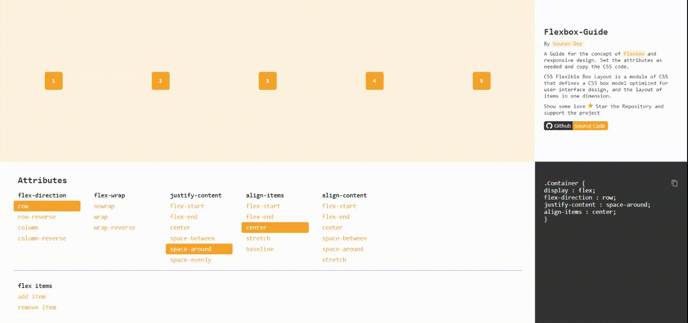

<a  href="http://Souravdey777.github.io/flexbox-guide">

  

</a>

# `Flexbox-Guide`

⚡ A Guide for the concept of `Flexbox` and `Responsive Design`. Simply set the attributes as you needed and copy the CSS code. 🎉

<a  href="http://Souravdey777.github.io/flexbox-guide" target="_blank">

  

</a>

### Table of contents

- [Demo](#demo)
- [Video Demo](#video-demo)
- [Description](#description)
- [Concepts of `Flexbox`](#concepts-of-flexbox)
- [Technologies](#technologies)
- [Dependencies](#dependencies)
- [Features](#features)
- [Contribution and Support](#contribution-and-support)
- [Setup](#setup)
- [Learn More about `Flexbox`](#learn-more-about-flexbox)
- [Learn More about `Reactjs`](#learn-more-about-Reactjs)

### Demo

**[Why wait? Straightaway go to the website and join the `Awesomeness` 😎 ](http://Souravdey777.github.io/flexbox-guide).**

<a  href="http://Souravdey777.github.io/flexbox-guide" target="_blank">

  

</a>

**`Todo`**

- [ ] `Documentation`

### Video Demo

### Description

### Technologies

### Dependencies

### Features

### Contribution and Support

### Setup

##### Clone/download the repository on your local machine.

    `git clone https://github.com/Souravdey777/flexbox-guide.git`

##### Install dependencies

    `npm install` or `yarn install`

##### Run Snap Shot from the root directory.

    `npm start` or `yarn start`

### Learn More about `Flexbox`

### Learn More about `Reactjs`

You can learn more in the [Create React App documentation](https://facebook.github.io/create-react-app/docs/getting-started).

To learn `React`, check out the [React documentation](https://reactjs.org/).

##### Code Splitting

This section has moved here: https://facebook.github.io/create-react-app/docs/code-splitting

##### Analyzing the Bundle Size

This section has moved here: https://facebook.github.io/create-react-app/docs/analyzing-the-bundle-size

##### Making a Progressive Web App

This section has moved here: https://facebook.github.io/create-react-app/docs/making-a-progressive-web-app

##### Advanced Configuration

This section has moved here: https://facebook.github.io/create-react-app/docs/advanced-configuration

##### Deployment

This section has moved here: https://facebook.github.io/create-react-app/docs/deployment

##### `npm run build` fails to minify

This section has moved here: https://facebook.github.io/create-react-app/docs/troubleshooting#npm-run-build-fails-to-minify
